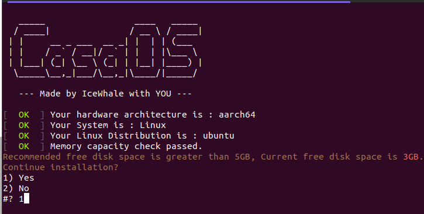
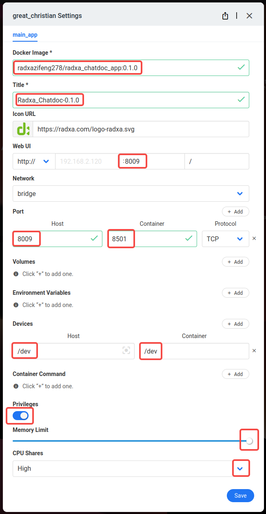
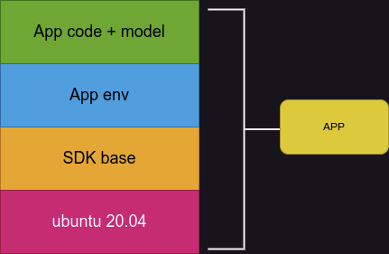

## CasaOS

### 目录

- [Docker 更新方法](#Docker-更新方法)

- [Docker 镜像目录迁移](#Docker-镜像目录迁移)

- [CasaOS 安装](#CasaOS-安装)

- [安装 radxa 一键启动大模型 Apps](#安装-radxa-一键启动大模型-Apps)

  - [安装自定义软件](#安装自定义软件)
  - [安装 radxa stable diffusion 文生图 App](#安装-radxa-stable-diffusion-文生图-App)
  - [安装 radxa whisper 语音识别总结 App](#安装-radxa-whisper-语音识别总结-App)
  - [安装 radxa ImageSearch 图片搜索 App](#安装-radxa-ImageSearch-图片搜索-App)
  - [安装 radxa chatdoc 文档聊天 App](#安装-radxa-chatdoc-文档聊天-App)
  - [App 启动与卸载](#App-启动与卸载)

- [App 构建方法](#App-构建方法)

  

### Docker 更新方法

- 查看当前 Dokcer 版本

  ```bash
  docker --version
  ```

- 如果版本低于 24.0.7 卸载 docker

  ```bash 
  for pkg in docker.io docker-doc docker-compose docker-compose-v2 podman-docker containerd runc; do sudo apt-get remove $pkg; done
  ```

- 配置 Docker apt 仓库

  ```bash
  # Add Docker's official GPG key:
  sudo apt-get update
  sudo apt-get install ca-certificates curl gnupg
  sudo install -m 0755 -d /etc/apt/keyrings
  curl -fsSL https://download.docker.com/linux/ubuntu/gpg | sudo gpg --dearmor -o /etc/apt/keyrings/docker.gpg
  sudo chmod a+r /etc/apt/keyrings/docker.gpg
  
  # Add the repository to Apt sources:
  echo \
    "deb [arch=$(dpkg --print-architecture) signed-by=/etc/apt/keyrings/docker.gpg] https://download.docker.com/linux/ubuntu \
    $(. /etc/os-release && echo "$VERSION_CODENAME") stable" | \
    sudo tee /etc/apt/sources.list.d/docker.list > /dev/null
  sudo apt-get update
  ```

- 获取预下载的新版deb包（如无会无法安装最新版docker），并手动安装
  ```bash
  wget https://github.com/radxa-edge/TPU-Edge-AI/releases/download/v0.1.0/Docker_Naspackage.zip
  unzip Docker_Naspackage.zip
  
  cd Docker_Naspackage
  sudo apt install ./*.deb
  ```

- 安装新版Docker
  ```bash
  sudo apt-get install docker-ce docker-ce-cli containerd.io docker-buildx-plugin docker-compose-plugin
  ```


### Docker 镜像目录迁移

因为Docker 默认安装于根目录，此时拉取镜像会把镜像安装在/var/lib/docker里，很容易把根目录占满。

在这里将讲述如何们利用软链接的方法将 docker 文件夹软链接到大容量的硬盘下（强烈建议在安装docker后立即建立）

- 查看当前主机的磁盘空间

  ```bash
  df -h
  ```

  

  此时发现 /data 目录下有充足的空间（如有更大的空间请使用更大空间的目录），此案例使用/data


- 利用**超级用户**将/var/lib/docker剪切到目标目录中(/data)

  ```bash
  sudo su
  mv /var/lib/docker /data
  ```

- 利用**超级用户**建立软链接
  ```bash
  ln -s /data/docker /var/lib
  ```

  此时软链接就创建完成，输入命令 ls -l /vae/lib/docker 可以查看软链接的链接地址

  ```bash 
  $ ls -l /var/lib/docker
  lrwxrwxrwx 1 root root 16 Dec 20 17:42 /var/lib/docker -> /data/docker
  ```


### CasaOS 安装

- 安装 CasaOS 需要检查当前的 docker 版本，如版本低于24.0.7需要卸载并更新，BM1684X docker更新方法[可看这里](#Docker-更新方法)

  ```bash
  curl -fsSL https://get.casaos.io | sudo bash
  ```

- 跟随安装引导安装

  

  如果根目录空间低于 5GB， 仍然能通过输入 1 进行强制安装

    

- 通过端口 bm1684:81 访问 CasaOS, 首次访问需要创建账户
  

  


### 安装 radxa 一键启动大模型 Apps

这里将介绍如何在 CasaOS 安装 radxa 大模型 App, CasaOS 中的第三方 App 以 docker image 的形式进行安装，
上传到 CasaOS App store [可参考这里](https://github.com/IceWhaleTech/CasaOS-AppStore/tree/main)，
radxa 目前已将 `Stable Diffusion`, `whisper`, `chatdoc`, `imagesearch` 四个大模型App上传至 [docker hub](https://hub.docker.com/u/radxazifeng278)， 
更多详细信息清参考 [App 构建方法](#App-构建方法)


| App                                                          | Docker Image                             | Container port |
| ------------------------------------------------------------ | ---------------------------------------- | -------------- |
| [Radxa Stable Diffusion](#安装-radxa-stable-diffusion-文生图-App) | radxazifeng278/radxa_sd_app:0.1.0        | 8999           |
| [Radxa whisper](#安装-radxa-whisper-语音识别总结-App)        | radxazifeng278/radxa_whisper_app:0.1.0   | 7860           |
| [Radxa ImageSearch](#安装-radxa-ImageSearch-图片搜索-App)    | radxazifeng278/radxa_imgsearch_app:0.1.0 | 8501           |
| [Radxa chatdoc](#安装-radxa-chatdoc-文档聊天-App)            | radxazifeng278/radxa_chatdoc_app:0.1.0   | 8501           |


#### 安装自定义软件

- 点击 CasaOS App 栏的 "+" 标志，选择 Install a customized app

 


#### 安装 radxa stable diffusion 文生图 App

- 填入 radxa stable diffusion 容器安装所需信息

  ##### 信息详解

  **Docker Image** 镜像名字，填入会自动在docker hub中拉取镜像

  ```bash
  radxazifeng278/radxa_sd_app:0.1.0 
  ```

  **Title**  App 名字，用户自定义

  *Icon URL* App 图标（可选）

  **Web UI 端口**  指定访问 App 时的默认访问端口, 建议用户可以在 7000-10000中选取，不可与其他 CasaOS 的 APP 端口冲突

  **Port** docker 容器端口映射，Host 端口为 Web UI 指定的端口， **容器端口为 8999**

  ```bash
  8999
  ```

  **Devices** 设备挂载，将 TPU 挂载进 Docker 容器中，建议全部挂载 Host: **/dev**,	Container: **/dev**

  **Privileges** 开启取得最高权限

  **Memory limit** 容器内存限制，建议拉满，否则可能无法启动服务

  **CPU Shares** CPU 能力，建议 Medium

  


- 整个安装方法如同以下 docker 命令创建容器，CasaOS 对其进行管理
  ```bash
  docker run -d -p 9001:8999 --privileged --device=/dev:/dev radxazifeng278/radxa_sd_app:0.1.0
  ```


#### 安装 radxa whisper 语音识别总结 App

- 填入 radxa whisper 容器安装所需信息

  ##### 信息详解

  **Docker Image** 镜像名字，填入会自动在docker hub中拉取镜像

  ```bash
  radxazifeng278/radxa_whisper_app:0.1.0
  ```

  **Title** App名字，用户自定义

  *Icon URL* App 图标(可选)

  **Web UI 端口** 指定访问 App 时的默认访问端口, 建议用户可以在 7000-10000中选取，不可与其他 CasaOS 的 APP 端口冲突

  **Port** docker 容器端口映射，Host 端口为 Web UI 指定的端口， **容器端口为 7860**

  ```bash
  7860
  ```

  **Devices** 设备挂载，将 TPU 挂载进 Docker 容器中，建议全部挂载 Host: **/dev**,	Container: **/dev**

  **Privileges** 开启取得最高权限

  **Memory limit** 容器内存限制，建议拉满，否则可能无法启动服务

  **CPU Shares** CPU 能力，建议 Medium

  


- 整个安装方法如同以下 docker 命令创建容器，CasaOS 对其进行管理

  ```bash
  docker run -d -p 8004:7860 --privileged --device=/dev:/dev radxazifeng278/radxa_whisper_app:0.1.0
  ```


#### 安装 radxa ImageSearch 图片搜索 App

- 填入 radxa ImageSearch 容器安装所需信息

  ##### 信息详解

  **Docker Image** 镜像名字，填入会自动在 docker hub 中拉取镜像

  ```bash
  radxazifeng278/radxa_imgsearch_app:0.1.0
  ```

  **Title** App 名字，用户自定义

  *Icon URL* App 图标(可选)

  **Web UI 端口** 指定访问 App 时的默认访问端口, 建议用户可以在 7000-10000 中选取，不可与其他 CasaOS 的 APP 端口冲突

  **Port** docker 容器端口映射，Host 端口为 Web UI 指定的端口， **容器端口为 8501**

  ```bash
  8501
  ```

  **Devices** 设备挂载，将 TPU 挂载进 Docker 容器中，建议全部挂载 Host: **/dev**,	Container: **/dev**

  **Privileges** 开启取得最高权限

  **Memory limit** 容器内存限制，建议拉满，否则可能无法启动服务

  **CPU Shares** CPU 能力，建议 Medium

  


- 整个安装方法如同以下 docker 命令创建容器，CasaOS 对其进行管理

  ```bash
  docker run -d -p 8007:8501 --privileged --device=/dev:/dev radxazifeng278/radxa_imgsearch_app:0.1.0
  ```


#### 安装 radxa chatdoc 文档聊天 App

**安装 chatdoc 前必须参考[内存分布修改工具](内存分布修改工具.md) 修改 1684X 内存分配**

建议分配 -NPU 7168, -VPU 2048, -VPP 3072

- 填入 radxa  chatdoc 容器安装所需信息

  ##### 信息详解

  **Docker Image** 镜像名字，填入会自动在 docker hub中拉取镜像

  ```bash
  radxazifeng278/radxa_chatdoc_app:0.1.0
  ```

  **Title** App名字，用户自定义

  *Icon URL* App 图标(可选)

  **Web UI 端口** 指定访问App时的默认访问端口, 建议用户可以在 7000-10000 中选取，不可与其他 CasaOS 的 APP 端口冲突

  **Port** docker 容器端口映射，Host 端口为 Web UI 指定的端口， **容器端口为 8501**

  ```bash
  8501
  ```

  **Devices** 设备挂载，将 TPU 挂载进 Docker 容器中，建议全部挂载 Host: **/dev**,	Container: **/dev**

  **Privileges** 开启取得最高权限

  **Memory limit** 容器内存限制，建议拉满，否则可能无法启动服务

  **CPU Shares** CPU 能力，建议High

  


- 整个安装方法如同以下 docker 命令创建容器，CasaOS 对其进行管理

  ```bash
  docker run -d -p 8009:8501 --privileged --device=/dev:/dev radxazifeng278/radxa_chatdoc_app:0.1.0
  ```


### App 启动与卸载

CasaOS 中 App 开启状态为 App 图标颜色高亮，关闭状态为 App 图标灰色状态

启动 App 单击图标即可，也可以在选中 App 右上角图标更多功能选项中启动

卸载 App 单击 Uninstall 即可


### App 构建方法

在参考Apo构建方法前可先参考 [手动部署应用 ](Stable_Diffusion.md)文档熟悉整个应用部署流程过程与细节。

CasaOS 的第三方应用利用 docker image 创建容器并安装到 CasaOS 中，CasaOS 可对容器配置进行设置与管理, 在此之前我们需要准备我们的 Docker image 且 Dockerfile, 这里将以 radxa stable diffusion 为例子详细讲述大模型 App 的 docker image 的构建过程。

radxa 大模型 App image 是以 ubuntu20.04 为基础进行四层 layer 的方式进行拆分构建，每层的构建都是基于上一层，分别是 ubuntu20.04 层， SDK base 层，App env 运行所需环境层，与顶层 App code + model 源码和模型层。


#### SDK base 层

在SDK base 中安装了必备的工具： libncurses5, libatomic1, kmod, python3, python3-pip, vim 

并安装了 sophon SDK: libsophon-0.5.0, sophon-ffmpeg_0.7.1, sophon-opencv_0.7.1 这三个 deb 与 sophon-sail 和 tpu-perf 模块

***Dockerfile***

```dockerfile
FROM ubuntu:20.04

LABEL maintainer="Zifeng ZHANG <zhangzifeng@radxa.com>"

WORKDIR /tools

COPY tools .

RUN apt update && \
    apt install -y libncurses5 libatomic1 kmod python3 python3-pip vim && \
    apt install -y ./sophon-soc-libsophon_0.5.0_arm64.deb && \
    apt install -y ./sophon-mw-soc-sophon-ffmpeg_0.7.1_arm64.deb && \
    apt install -y ./sophon-mw-soc-sophon-opencv_0.7.1_arm64.deb && \
    pip3 install ./sophon_arm-3.7.0-py3-none-any.whl && \
    pip3 install ./tpu_perf-1.2.31-py3-none-manylinux2014_aarch64.whl
```

  

#### App env 层

App env 层基于 SDK base 镜像基础上添加 App 运行必须的环境，例如 python modules, 和一些特殊需要安装的 deb, 
拆分此层的目的是后续 App 源码更新在环境不变的情况下减少安装速度，并且可通过 App env + SDK base 镜像外部挂载 App 源码和模型卷可直接启动服务，
可在此层加入 CMD 默认启动 App 服务

  

  

  ***Dockerfile***

  ```dockerfile
  FROM radxazifeng278/radxa_min:0.1.4
  
  LABEL maintainer="Zifeng ZHANG <zhangzifeng@radxa.com>"
  
  WORKDIR /env
  
  COPY requirements.txt .
  
  RUN pip3 install -r requirements.txt
      
  WORKDIR /StableDiffusion_v2-TPU
  
  CMD ["bash", "run.sh"]
  ```

  

- ### App source code with model 层

  App source code with model 层将基于上一 App env 镜像中放入源码与模型从而构建成一个完整的 App，并且加入 App 启动命令 CMD

  

  

  

  ***Dockerfile***

  ```dockerfile
  FROM radxazifeng278/radxa_sd_env:0.1.0
  
  LABEL maintainer="Zifeng ZHANG <zhangzifeng@radxa.com>"
  
  WORKDIR /StableDiffusion_v2-TPU
  
  COPY StableDiffusion_v2-TPU .
  
  CMD ["bash", "run.sh"]
  ```
  


当得到完整的 App 镜像后可参考 [安装 radxa 一键启动大模型 Apps](#安装-radxa-一键启动大模型-Apps) 对自定义 App 在 CasaOS 中进行安装
