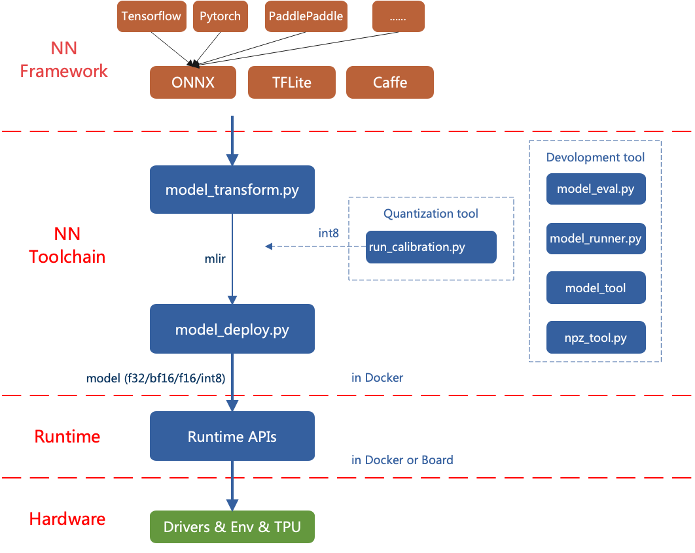
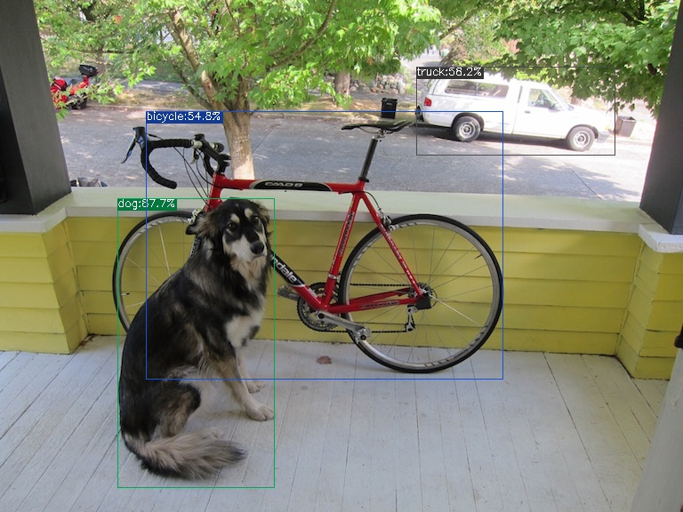

## TPU-MLIR 编译

### 目录
- [TPU-MLIR 的整体架构](#tpu-mlir-的整体架构)

- [环境配置](#环境配置)

- [模型转换](#模型转换)
    - [转换 MLIR](#转换-MLIR)
    - [生成 bmodel](#生成-bmodel)
        - [MLIR 生成 F32 bmodel](#MLIR-生成-F32-bmodel)
        - [MLIR 生成 F16 bmodel](#MLIR-生成-F16-bmodel)
        - [MLIR 生成 INT8 bmodel](#MLIR-生成-INT8-bmodel)
        - [编译为 INT8 非对称量化模型](#编译为-INT8-非对称量化模型)
        - [编译为混合精度模型](#编译为混合精度模型)
      
- [效果对比](#效果对比)

TPU-MLIR 是算能 AI 芯片的 TPU 编译器工具链，其可以将不同框架下预训练的神经网络模型, 
转化为可以在算能 BM1684 和 BM1684X 系列 TPU 上高效运算的 bmodel 格式模型。
目前直接支持的框架有 PyTorch, ONNX, Caffe 和 TFLite。其他框架的模型需要转换成 ONNX 模型，如何将其他深度学习架构的网络模型转换成ONNX, 
可以参考ONNX官网: [https://github.com/onnx/tutorials](https://github.com/onnx/tutorials.html)。

模型转换需要在指定的 docker 执行, 主要分两步, 第一是通过 `model_transform.py` 将原始模型转换成 mlir 文件, 第二是通过 `model_deploy.py` 将 mlir 文件转换成 bmodel。
如果要转 INT8 模型, 则需要准备校准数据集然后调用 `run_calibration.py` 生成校准表, 最后使用 `model_deploy.py` 生成 INT8 量化 bmodel。
如果 INT8 模型不满足精度需要, 可以在完成 INT8 量化 bmodel 操作后调用 `run_qtable.py` 生成混合精度量化表, 用来决定哪些层采用浮点计算， 最后传给 model_deploy.py 生成混精度 bmodel 模型。

### TPU-MLIR 的整体架构




### 环境配置

- 在需要编译的工程同级目录中克隆 TPU-MLIR 远程仓库

    ```bash
    git clone https://github.com/zifeng-radxa/tpu-mlir
    ```

- 拉取最新的 TPU-MLIR docker 镜像， docker 镜像版本与 TPU-MLIR 要保持同期最新，建议首次拉取后更改 tag 防止后续使用拉取 TPU-MLIR 时版本不一致，并且备份一份纯净的 TPU-MLIR
    ```bash
    docker pull sophgo/tpuc_dev:latest
    ```
- 启动 TPU-MLIR docker 镜像系统
    ```bash
    docker run --privileged --name myname -v $PWD:/workspace -it sophgo/tpuc_dev:latest
    ```

- 进入 docker 后初始化 TPU-MLIR 工程环境
    ```bash
    cd /workspace/tpu-mlir
    source ./envsetup.sh
    ./build.sh
    ```

### 模型转换

本案例以 [yolov5s.onnx](https://github.com/ultralytics/yolov5/releases/download/v6.0/yolov5s.onnx) 为例, 介绍如何编译并迁移一个 onnx 模型至 BM1684X TPU 平台运行，本章节模型编译都在 docker 中运行。

#### 转换 MLIR
- 在 **TPU-MLIR 同级目录** 下创建工作目录, 将所需模型与所需数据集(校准数据集，测试数据集)放入工作目录下

    ```bash 
    mkdir yolov5s && cd yolov5s
    wget https://github.com/ultralytics/yolov5/releases/download/v6.0/yolov5s.onnx
    cp -r ../tpu-mlir/regression/dataset/COCO2017/ .
    cp -r ../tpu-mlir/regression/image/ .
    ```

- ONNX 转 MLIR

    如果模型是图片输入, 在转模型之前我们需要了解模型的预处理。如果模型用预处理后的 npz 文件做输入, 则不需要考虑预处理。
    官网 yolov5s 输入的图片是 rgb, 每个值会乘以 1/255 , 转换成 mean 和 scale 对应为 `0.0,0.0,0.0` 和 `0.0039216,0.0039216,0.0039216` 
    
    模型转换命令如下:

    ```bash
    mkdir build && cd build
    model_transform.py \
        --model_name yolov5s \
        --model_def ../yolov5s.onnx \
        --input_shapes [[1,3,640,640]] \
        --mean 0.0,0.0,0.0 \
        --scale 0.0039216,0.0039216,0.0039216 \
        --keep_aspect_ratio \
        --pixel_format rgb \
        --test_input ../image/dog.jpg \
        --test_result yolov5s_top_outputs.npz \
        --mlir yolov5s.mlir 
    ```
    `model_transform.py` 会生产一个中间格式模型 mlir, 通过 `model_deploy.py` 生成对应平台对应精度的 bmodel

    `model_transform.py`参数解析
    
    | **参数**          | **必需** | **描述**                                        |
    | ----------------- | -------- |-----------------------------------------------|
    | model_name        | 是       | 模型名称                                          |
    | model_def         | 是       | 模型定义文件（`.onnx`、`.pt`、`.tflite` 或 `.prototxt`） |
    | model_data        | 否       | 指定模型权重文件，当为caffe模型时需要（对应`.caffemodel`文件）      |
    | input_shapes      | 否       | 输入形状，例如 `[[1,3,640,640]]`（二维数组），支持多个输入        |
    | resize_dims       | 否       | 要调整为的原始图像大小。如果未指定，将调整为模型的输入大小                 |
    | keep_aspect_ratio | 否       | 调整大小时是否保持宽高比。默认为 False。如果设置，则在不足的部分填充0        |
    | mean              | 否       | 图像每个通道的均值。默认为 0.0, 0.0, 0.0                   |
    | scale             | 否       | 图像每个通道的缩放比例。默认为 1.0, 1.0, 1.0                 |
    | pixel_format      | 否       | 图像类型，可以是 rgb、bgr、gray 或 rgbd                  |
    | output_names      | 否       | 输出的名称。如果未指定，则使用模型的输出；否则使用指定的名称作为输出            |
    | test_input        | 否       | 用于验证的输入文件，可以是图像、npy 或 npz。如果未指定，将不进行验证        |
    | test_result       | 否       | 保存验证结果的输出文件                                   |
    | excepts           | 否       | 需要从验证中排除的网络层的名称。用逗号分隔                         |
    | debug             | 否       | 如果开启调试，模型文件将保留；否则在转换完成后删除                     |
    | mlir              | 是       | 输出的mlir文件名（包括路径）                              |
    

#### 生成 bmodel

##### MLIR 生成 F32 bmodel

```bash
model_deploy.py \
  --mlir yolov5s.mlir \
  --quantize F32 \
  --processor bm1684x \
  --test_input yolov5s_in_f32.npz \
  --test_reference yolov5s_top_outputs.npz \
  --model yolov5s_1684x_f32.bmodel
```

`model_deploy.py `参数解析:

| **参数**          | **必需** | **描述**                                                                   |
| ----------------- | -------- |--------------------------------------------------------------------------|
| mlir              | 是       | Mlir 文件                                                                  |
| quantize          | 是       | 量化类型（F32/F16/BF16/INT8）                                                  |
| processor         | 是       | 模型将使用的平台。目前仅支持 bm1684x/bm1684/cv183x/cv182x/cv181x/cv180x, 将来将支持更多的TPU平台 |
| calibration_table | 否       | 量化表的路径。进行 INT8 量化时需要                                                     |
| tolerance         | 否       | MLIR 量化和 MLIR fp32 推断结果之间的最小相似度容差                                        |
| correctnetss      | 否       | 模拟器和 MLIR 量化推断结果之间的最小相似度容差。默认为 0.99,0.90                                 |
| excepts           | 否       | 需要从验证中排除的网络层的名称。用逗号分隔                                                    |
| debug             | 否       | 如果开启调试，模型文件将保留；否则在转换完成后删除                                                |
| model             | 是       | 输出模型文件的名称（包括路径）                                                          |
| dynamic           | 否       | 用于支持动态形状的动态代码生成                                                          |


##### MLIR 生成 F16 bmodel
```bash
model_deploy.py \
  --mlir yolov5s.mlir \
  --quantize F16 \
  --processor bm1684x \
  --model yolov5s_1684x_f16.bmodel
```

##### MLIR 生成 INT8 bmodel

- 生成校准表，转INT8模型前需要运行`run_calibration.py`得到校准表; 输入数据的数量根据情况准备100~1000张左右。

- 使用校准表, 生成对称或非对称 bmodel。如果对称符合需求, 一般不建议用非对称, 因为非对称的性能会略差于对称模型。

- 这里用现有的100张来自 COCO2017 的图片举例, 执行`run_calibration.py`:
```bash
run_calibration.py yolov5s.mlir \
    --dataset ../COCO2017 \
    --input_num 100 \
    -o yolov5s_cali_table
```

- 编译为INT8对称量化模型, 执行如下命令:

```bash
model_deploy.py \
    --mlir yolov5s.mlir \
    --quantize INT8 \
    --calibration_table yolov5s_cali_table \
    --chip bm1684x \
    --model yolov5s_1684x_int8_sym.bmodel
```
编译完成后, 会生成名为 yolov5s_1684x_int8_sym.bmodel 的文件

##### 编译为 INT8 非对称量化模型

转成 INT8 非对称量化模型, 执行如下命令:

```bash
$ model_deploy.py \
    --mlir yolov5s.mlir \
    --quantize INT8 \
    --asymmetric \
    --calibration_table yolov5s_cali_table \
    --chip bm1684x \
    --model yolov5s_1684x_int8_asym.bmodel
```

编译完成后, 会生成名为  yolov5s_1684x_int8_asym.bmodel 的文件

##### 编译为混合精度模型

如果 INT8 对称量化模型出现不能接受的精度损失在完成 INT8 对称量化模型的基础上, 执行如下步骤

- 使用 run_qtable.py 生成混精度量化表, 相关参数说明如下:
    ```bash
    run_qtable.py yolov5s.mlir \
        --dataset ../COCO2017 \
        --calibration_table yolov5s_cali_table \
        --chip bm1684x \
        --min_layer_cos 0.999 \ #若这里使用默认的0.99时，程序会检测到原始int8模型已满足0.99的cos，从而直接不再搜素
        --expected_cos 0.9999 \
        -o yolov5s_qtable
    ```

    `run_qtable.py`参数功能
    
    | 参数名            | 必选？ | 说明                                                           |
    | :---------------- | :----- |:-------------------------------------------------------------|
    | 无                | 是     | 指定 mlir 文件                                                   |
    | dataset           | 否     | 指定输入样本的目录, 该路径放对应的图片, 或 npz, 或 npy                           |
    | data_list         | 否     | 指定样本列表, 与 dataset 必须二选一                                      |
    | calibration_table | 是     | 输入校准表                                                        |
    | chip              | 是     | 指定模型将要用到的平台, 支持 bm1684x/bm1684/cv183x/cv182x/cv181x/cv180x   |
    | fp_type           | 否     | 指定混精度使用的 float 类型, 支持 auto,F16,F32,BF16，默认为 auto，表示由程序内部自动选择 |
    | input_num         | 否     | 指定输入样本数量, 默认用10个                                             |
    | expected_cos      | 否     | 指定期望网络最终输出层的最小 cos 值,一般默认为0.99即可，越小时可能会设置更多层为浮点计算            |
    | min_layer_cos     | 否     | 指定期望每层输出 cos 的最小值，低于该值会尝试设置浮点计算, 一般默认为0.99即可                 |
    | debug_cmd         | 否     | 指定调试命令字符串，开发使用, 默认为空                                         |
    | o                 | 是     | 输出混精度量化表                                                     |


- 生成混合精度的bmodel
    ```bash
    model_deploy.py \
        --mlir yolov5s.mlir \
        --quantize INT8 \
        --quantize_table yolov5s_qtable \
        --calibration_table yolov5s_cali_table \
        --chip bm1684x \
        --model yolov5s_1684x_mix.bmodel
    ```


### 效果对比

在 TPU-MLIR 中有用 python 写好的 yolov5 用例, 源码路径 [tpu-mlir/python/samples/detect_yolov5.py](https://github.com/zifeng-radxa/tpu-mlir/blob/master/python/samples/detect_yolov5.py), 用于对图片进行目标检测。阅读该代码可以了解模型是如何使用的: 先预处理得到模型的输入, 然后推理得到输出, 最后做后处理。 用以下代码分别来验证onnx/f32/int8的执行结果。

- onnx 模型的执行方式如下, 得到 dog_onnx.jpg:

    ```bash
    detect_yolov5.py \
        --input ../image/dog.jpg \
        --model ../yolov5s.onnx \
        --output dog_onnx.jpg
    ```
    

- f32 bmodel 的执行方式如下, 得到 dog_f32.jpg:

    ```bash
    detect_yolov5.py \
        --input ../image/dog.jpg \
        --model yolov5s_1684x_f32.bmodel \
        --output dog_f32.jpg
    ```
    


- f16 bmodel 的执行方式如下, 得到 dog_f16.jpg:

    ```bash
    detect_yolov5.py \
        --input ../image/dog.jpg \
        --model yolov5s_1684x_f16.bmodel \
        --output dog_f16.jpg
    ```
    


- int8 对称 bmodel 的执行方式如下, 得到 dog_int8_sym.jpg:

    ```bash
    detect_yolov5.py \
        --input ../image/dog.jpg \
        --model yolov5s_1684x_int8_sym.bmodel \
        --output dog_int8_sym.jpg
    ```
    

- int8 非对称 bmodel 的执行方式如下, 得到 dog_int8_asym.jpg :

    ```bash
    detect_yolov5.py \
        --input ../image/dog.jpg \
        --model yolov5s_1684x_int8_asym.bmodel \
        --output dog_int8_asym.jpg
    ```
    

- 混合精度 bmodel 的执行方式如下, 得到 dog_mix.jpg :

    ```bash
    detect_yolov5.py \
        --input ../image/dog.jpg \
        --model yolov5s_1684x_fb16.bmodel \
        --output dog_fb16.jpg
    ```
    


