## CasaOS

### Table of Contents

- [Docker Update Method](#docker-update-method)
- [Docker Image Directory Migration](#docker-image-directory-migration)
- [CasaOS Installation](#casaos-installation)
- [Install Radxa One-Click launch Large Model Apps](#install-radxa-one-click-launch-large-model-apps)
  - [Install Custom Software](#install-custom-software)
  - [Install Radxa Stable Diffusion App](#install-radxa-stable-diffusion-app)
  - [Install Radxa Whisper Speech Recognition App](#install-radxa-whisper-speech-recognition-app)
  - [Install Radxa ImageSearch App](#install-radxa-imagesearch-app)
  - [Install Radxa Chatdoc Document Chat App](#install-radxa-chatdoc-document-chat-app)
  - [App Start and Uninstall](#app-startup-and-uninstallation)
- [App Building Method](#app-building-method)

### Docker Update Method

- Check the current Docker version:

  ```bash
  docker --version
  ```

- If the version is lower than 24.0.7, uninstall Docker:

  ```bash
  for pkg in docker.io docker-doc docker-compose docker-compose-v2 podman-docker containerd runc; do sudo apt-get remove $pkg; done
  ```

- Configure Docker apt repository:

  ```bash
  # Add Docker's official GPG key:
  sudo apt-get update
  sudo apt-get install ca-certificates curl gnupg
  sudo install -m 0755 -d /etc/apt/keyrings
  curl -fsSL https://download.docker.com/linux/ubuntu/gpg | sudo gpg --dearmor -o /etc/apt/keyrings/docker.gpg
  sudo chmod a+r /etc/apt/keyrings/docker.gpg
  
  # Add the repository to Apt sources:
  echo \
    "deb [arch=$(dpkg --print-architecture) signed-by=/etc/apt/keyrings/docker.gpg] https://download.docker.com/linux/ubuntu \
    $(. /etc/os-release && echo "$VERSION_CODENAME") stable" | \
    sudo tee /etc/apt/sources.list.d/docker.list > /dev/null
  sudo apt-get update
  ```

- Get the pre-downloaded new deb package (without this, it may not be possible to install the latest version of Docker) and manually install it:

  ```bash
  wget https://github.com/radxa-edge/TPU-Edge-AI/releases/download/v0.1.0/Docker_Naspackage.zip
  unzip Docker_Naspackage.zip
  
  cd Docker_Naspackage
  sudo apt install ./*.deb
  ```

- Install the new version of Docker:

  ```bash
  sudo apt-get install docker-ce docker-ce-cli containerd.io docker-buildx-plugin docker-compose-plugin
  ```

### Docker Image Directory Migration

Since Docker is installed in the root directory by default, pulling images will install them in /var/lib/docker, which can easily fill up the root directory.

Here, we will explain how to use the soft link method to link the docker folder to a large-capacity hard disk (it is strongly recommended to establish it immediately after installing Docker).

- Check the current host's disk space:

  ```bash
  df -h
  ```

  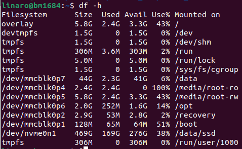

  At this point, you can see that there is ample space in the /data directory (use a directory with more space if available), in this example, /data.

- Use the **superuser** to move /var/lib/docker to the target directory (/data):

  ```bash
  sudo su
  mv /var/lib/docker /data
  ```

- Use the **superuser** to create a soft link:

  ```bash
  ln -s /data/docker /var/lib
  ```

  Now the soft link is created. You can check the link address with the command `ls -l /vae/lib/docker`.

  ```bash 
  $ ls -l /var/lib/docker
  lrwxrwxrwx 1 root root 16 Dec 20 17:42 /var/lib/docker -> /data/docker
  ```
  

### CasaOS Installation

- To install CasaOS, you need to check the current Docker version. If the version is lower than 24.0.7, you should uninstall and update. For the BM1684X Docker update method, [refer to this section](#docker-update-method).

  ```bash
  curl -fsSL https://get.casaos.io | sudo bash
  ```

- Follow the installation guide.

  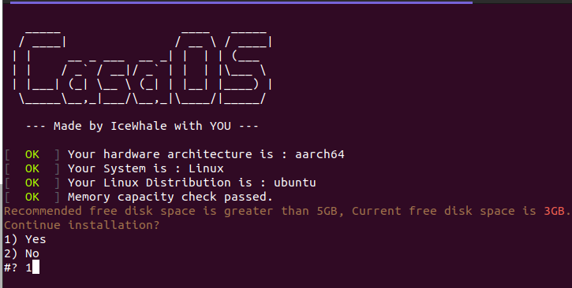

  If the root directory space is less than 5GB, you can still force the installation by entering `1`.

- Access CasaOS via port bm1684:81. On the first visit, you need to create an account.

  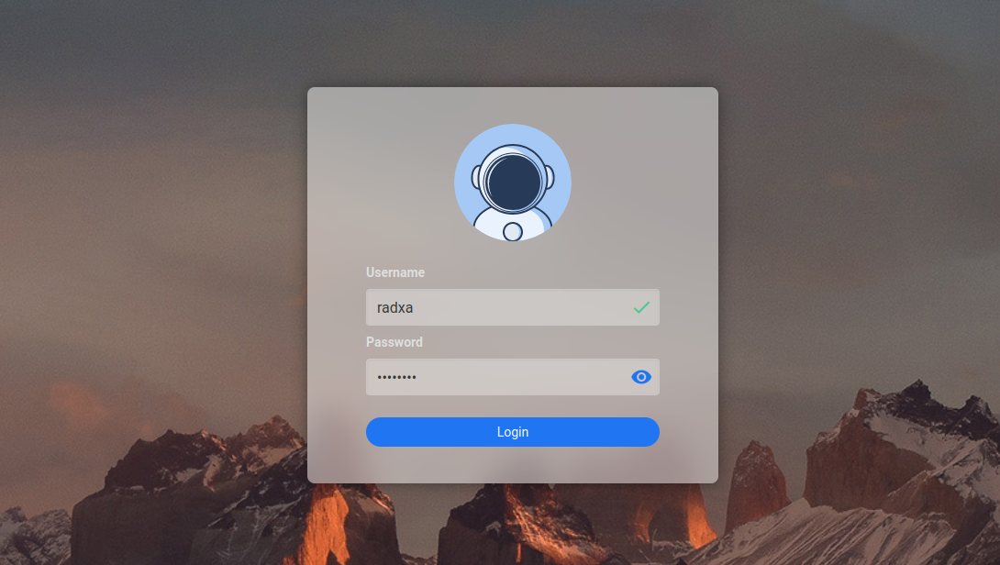

### Install Radxa One-Click launch Large Model Apps

Here, we will explain how to install Radxa large model apps on CasaOS. Third-party apps in CasaOS are installed in the form of Docker images, uploaded to the CasaOS App store [as mentioned here](https://github.com/IceWhaleTech/CasaOS-AppStore/tree/main). Radxa has currently uploaded four large model apps, namely `Stable Diffusion`, `Whisper`, `Chatdoc`, and `ImageSearch` to [Docker Hub](https://hub.docker.com/u/radxazifeng278).

| App                                                 | Docker Image                             | Container Port |
|-----------------------------------------------------| ---------------------------------------- | -------------- |
| [Radxa Stable Diffusion](#install-radxa-stable-diffusion-app) | radxazifeng278/radxa_sd_app:0.1.0        | 8999           |
| [Radxa Whisper](#install-radxa-whisper-speech-recognition-app) | radxazifeng278/radxa_whisper_app:0.1.0   | 7860           |
| [Radxa ImageSearch](#install-radxa-imagesearch-app) | radxazifeng278/radxa_imgsearch_app:0.1.0 | 8501           |
| [Radxa Chatdoc](#install-radxa-chatdoc-document-chat-app) | radxazifeng278/radxa_chatdoc_app:0.1.0   | 8501           |

#### Install Custom Software

- Click the "+" symbol in the CasaOS App section and choose "Install a customized app."

  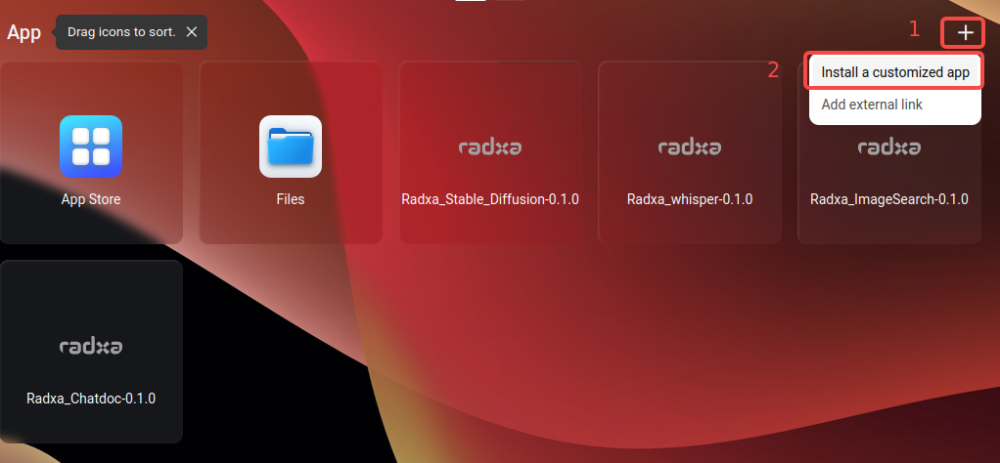

#### Install Radxa Stable Diffusion App

- Fill in the information required for the Radxa Stable Diffusion container installation.

  ##### Detailed Information

  **Docker Image**: The image name, filling it will automatically pull the image from Docker Hub.

  ```bash
  radxazifeng278/radxa_sd_app:0.1.0 
  ```

  **Title**: App name, user-defined.

  *Icon URL*: App icon (optional).

  **Web UI Port**: Specify the default access port when accessing the app. It is recommended to choose from 7000 to 10000, avoiding conflicts with other CasaOS app ports.

  **Port**: Docker container port mapping. Host port is the one specified in Web UI, and the container port is **8999**.

  ```bash
  8999
  ```

  **Devices**: Device mounts. Mount the TPU into the Docker container. It is recommended to mount all Host: **/dev**, Container: **/dev**.

  **Privileges**: Enable to get the highest privileges.

  **Memory limit**: Container memory limit. It is recommended to maximize it; otherwise, the service may not start.

  **CPU Shares**: CPU capability. Medium is recommended.

  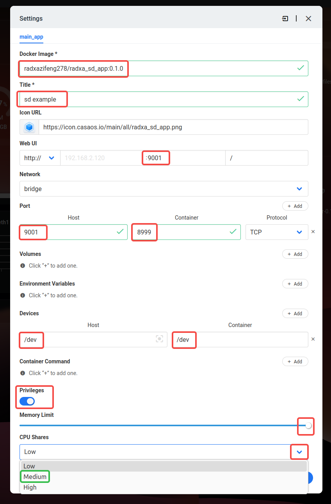

- The entire installation process is similar to the following Docker command to create a container, which is then managed by CasaOS.

  ```bash
  docker run -d -p 9001:8999 --privileged --device=/dev:/dev radxazifeng278/radxa_sd_app:0.1.0
  ```

#### Install Radxa Whisper Speech Recognition App

- Fill in the information required for the Radxa Whisper container installation.

  ##### Detailed Information

  **Docker Image**: The image name, filling it will automatically pull the image from Docker Hub.

  ```bash
  radxazifeng278/radxa_whisper_app:0.1.0
  ```

  **Title**: App name, user-defined.

  *Icon URL*: App icon (optional).

  **Web UI Port**: Specify the default access port when accessing the app. It is recommended to choose from 7000 to 10000, avoiding conflicts with other CasaOS app ports.

  **Port**: Docker container port mapping. Host port is the one specified in Web UI, and the container port is **7860**.

  ```bash
  7860
  ```

  **Devices**: Device mounts. Mount the TPU into the Docker container. It is recommended to mount all Host: **/dev**, Container: **/dev**.

  **Privileges**: Enable to get the highest privileges.

  **Memory limit**: Container memory limit. It is recommended to maximize it; otherwise, the service may not start.

  **CPU Shares**: CPU capability. Medium is recommended.

  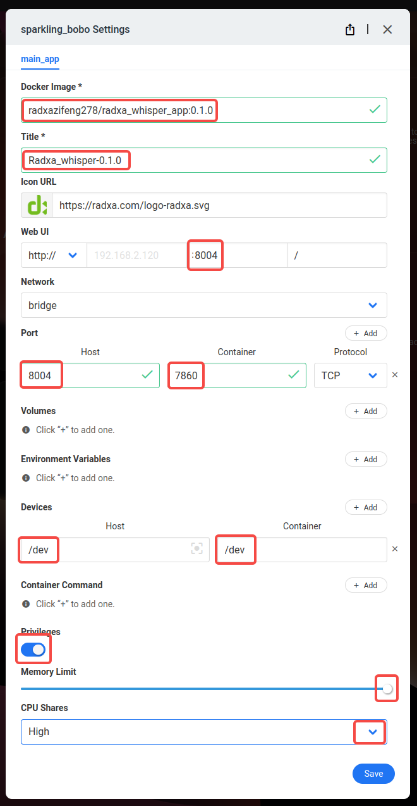

- The entire installation process is similar to the following Docker command to create a container, which is then managed by CasaOS.

  ```bash
  docker run -d -p 8004:7860 --privileged --device=/dev:/dev radxazifeng278/radxa_whisper_app:0.1.0
  ```

#### Install Radxa ImageSearch App

- Fill in the required information for the Radxa ImageSearch container installation.

  ##### Detailed Information

  **Docker Image**: The image name, filling it will automatically pull the image from Docker Hub.

  ```bash
  radxazifeng278/radxa_imgsearch_app:0.1.0
  ```

  **Title**: App name, user-defined.

  *Icon URL*: App icon (optional).

  **Web UI Port**: Specify the default access port when accessing the app. It is recommended to choose from 7000 to 10000, avoiding conflicts with other CasaOS app ports.

  **Port**: Docker container port mapping. Host port is the one specified in Web UI, and the container port is **8501**.

  ```bash
  8501
  ```

  **Devices**: Device mounts. Mount the TPU into the Docker container. It is recommended to mount all Host: **/dev**, Container: **/dev**.

  **Privileges**: Enable to get the highest privileges.

  **Memory limit**: Container memory limit. It is recommended to maximize it; otherwise, the service may not start.

  **CPU Shares**: CPU capability. Medium is recommended.

  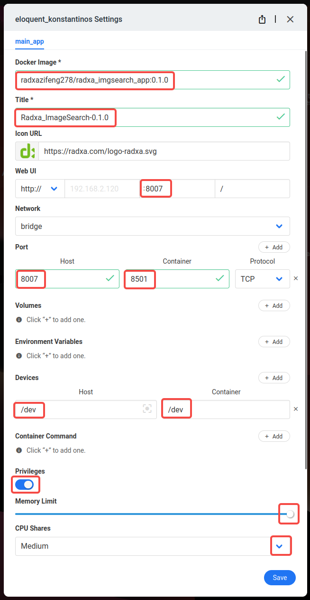

- The entire installation process is similar to the following Docker command to create a container, which is then managed by CasaOS.

  ```bash
  docker run -d -p 8007:8501 --privileged --device=/dev:/dev radxazifeng278/radxa_imgsearch_app:0.1.0
  ```

#### Install Radxa Chatdoc Document Chat App

**Before installing Chatdoc, it is necessary to refer to [Memory Distribution Modification Tool](memory_allocat.md) to modify the memory allocation of BM1684X.**

It is recommended to allocate -NPU 7168, -VPU 2048, -VPP 3072.

- Fill in the required information for the Radxa Chatdoc container installation.

  ##### Detailed Information

  **Docker Image**: The image name, filling it will automatically pull the image from Docker Hub.

  ```bash
  radxazifeng278/radxa_chatdoc_app:0.1.0
  ```

  **Title**: App name, user-defined.

  *Icon URL*: App icon (optional).

  **Web UI Port**: Specify the default access port when accessing the app. It is recommended to choose from 7000 to 10000, avoiding conflicts with other CasaOS app ports.

  **Port**: Docker container port mapping. Host port is the one specified in Web UI, and the container port is **8501**.

  ```bash
  8501
  ```

  **Devices**: Device mounts. Mount the TPU into the Docker container. It is recommended to mount all Host: **/dev**, Container: **/dev**.

  **Privileges**: Enable to get the highest privileges.

  **Memory limit**: Container memory limit. It is recommended to maximize it; otherwise, the service may not start.

  **CPU Shares**: CPU capability. High is recommended.

  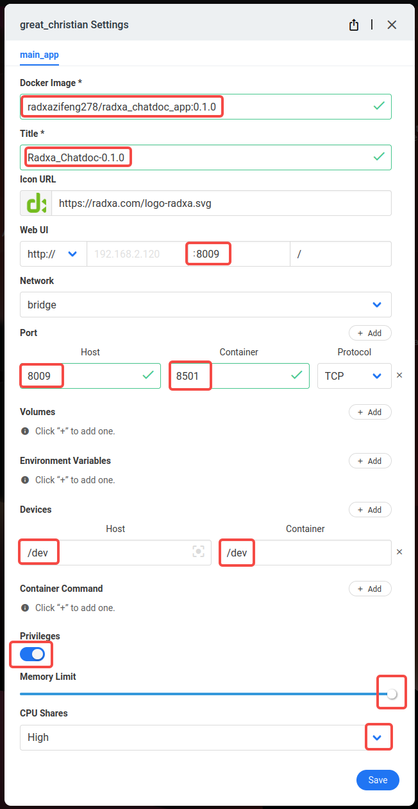

- The entire installation process is similar to the following Docker command to create a container, which is then managed by CasaOS.

  ```bash
  docker run -d -p 8009:8501 --privileged --device=/dev:/dev radxazifeng278/radxa_chatdoc_app:0.1.0
  ```
### App Startup and Uninstallation

In CasaOS, the App is in the startup state when the App icon is highlighted, and it is in the off state when the App icon is gray.

To start the App, simply click the icon. Alternatively, you can start it in the more functional options in the upper right corner of the selected App.

To uninstall the App, simply click "Uninstall."


### App Building Method

Before referring to the Apo construction method, you can first refer to the document [Manual Deployment of Applications](Stable_Diffusion.md) to familiarize yourself with the entire application deployment process and details.

CasaOS's third-party applications use Docker images to create containers and install them in CasaOS. CasaOS can set and manage container configurations. Before this, we need to prepare our Docker image and Dockerfile. Here, we will take Radxa Stable Diffusion as an example to explain the construction process of the Docker image of a large model App.

The Radxa large model App image is based on Ubuntu 20.04 and is built in a four-layer manner, with each layer built on top of the previous one. The layers are Ubuntu 20.04 layer, SDK base layer, App environment layer, and the top layer is the App code + model source code and model layer.

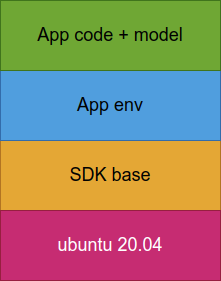

#### SDK Base Layer

In the SDK base, essential tools are installed: libncurses5, libatomic1, kmod, python3, python3-pip, vim.

Sophon SDK is also installed in this layer: libsophon-0.5.0, sophon-ffmpeg_0.7.1, sophon-opencv_0.7.1, as well as sophon-sail and tpu-perf modules.

***Dockerfile***

```dockerfile
FROM ubuntu:20.04

LABEL maintainer="Zifeng ZHANG <zhangzifeng@radxa.com>"

WORKDIR /tools

COPY tools .

RUN apt update && \
    apt install -y libncurses5 libatomic1 kmod python3 python3-pip vim && \
    apt install -y ./sophon-soc-libsophon_0.5.0_arm64.deb && \
    apt install -y ./sophon-mw-soc-sophon-ffmpeg_0.7.1_arm64.deb && \
    apt install -y ./sophon-mw-soc-sophon-opencv_0.7.1_arm64.deb && \
    pip3 install ./sophon_arm-3.7.0-py3-none-any.whl && \
    pip3 install ./tpu_perf-1.2.31-py3-none-manylinux2014_aarch64.whl
```

#### App Environment Layer

The App environment layer is based on the SDK base image and adds the environment necessary for App operation, such as Python modules and some deb packages that need to be installed. Splitting this layer is to reduce the installation speed in case of App source code updates without changing the environment. Additionally, the App source code and model volume can be directly mounted externally to start the service. You can add CMD to this layer to start the App service by default.

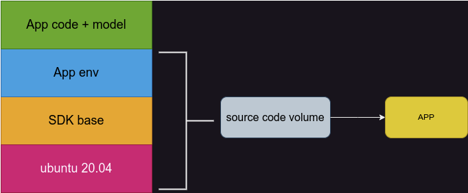

***Dockerfile***

```dockerfile
FROM radxazifeng278/radxa_min:0.1.4

LABEL maintainer="Zifeng ZHANG <zhangzifeng@radxa.com>"

WORKDIR /env

COPY requirements.txt .

RUN pip3 install -r requirements.txt
    
WORKDIR /StableDiffusion_v2-TPU

CMD ["bash", "run.sh"]
```

#### App Source Code with Model Layer

The App source code with the model layer is based on the previous App environment image, and the source code and model are added to build a complete App. CMD with the default App startup command is added to this layer.

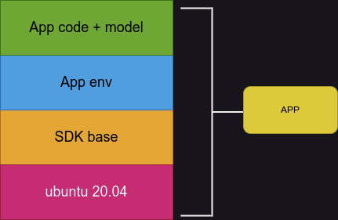

***Dockerfile***

```dockerfile
FROM radxazifeng278/radxa_sd_env:0.1.0

LABEL maintainer="Zifeng ZHANG <zhangzifeng@radxa.com>"

WORKDIR /StableDiffusion_v2-TPU

COPY StableDiffusion_v2-TPU .

CMD ["bash", "run.sh"]
```

Once you have the complete App image, you can refer to [Install Radxa One-Click launch Large Model Apps](#install-radxa-one-click-launch-large-model-apps) to install your custom App in CasaOS.

