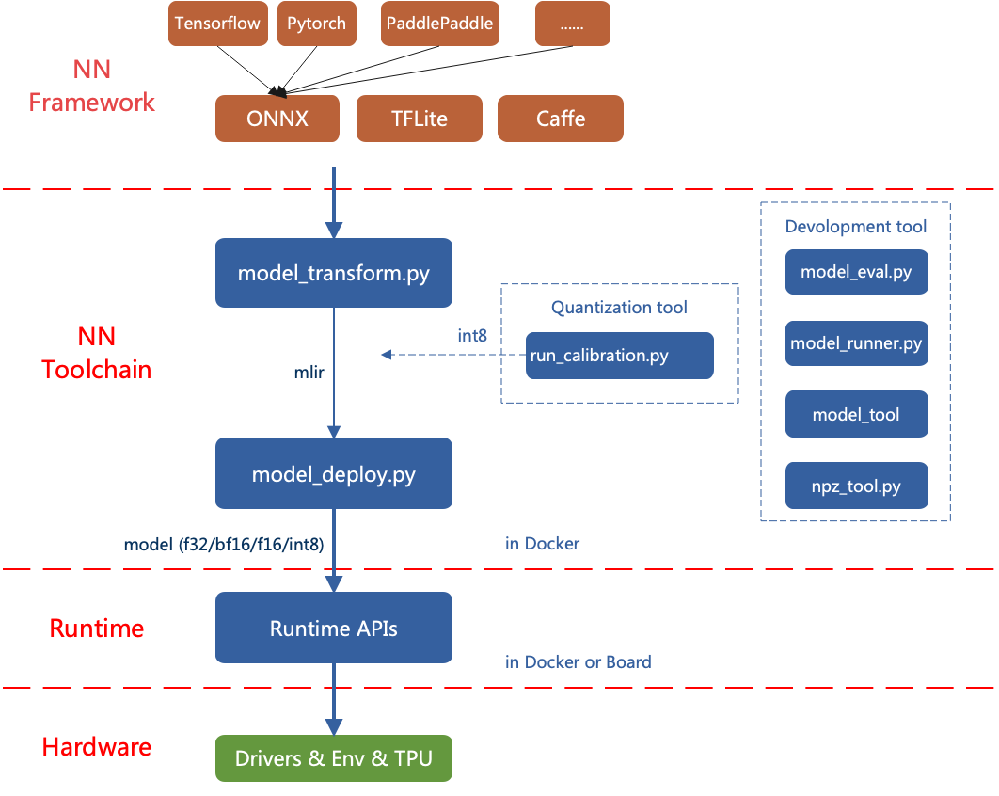
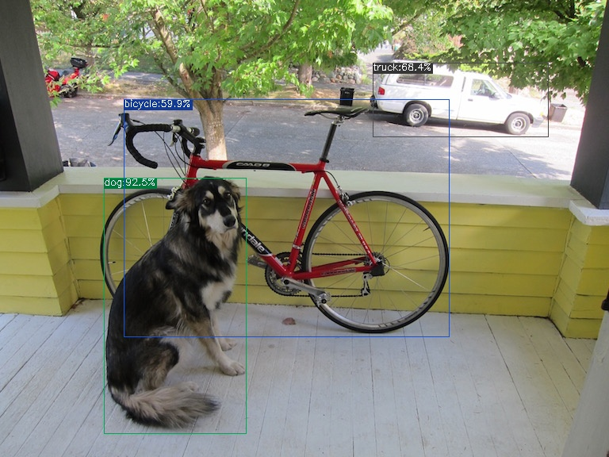

## TPU-MLIR Compilation

### Table of Contents
- [TPU-MLIR Architecture Overview](#tpu-mlir-architecture-overview)
- [Environment Setup](#environment-setup)
- [Model Conversion](#model-conversion)
    - [Convert to MLIR](#convert-to-mlir)
    - [Generate bmodel](#generate-bmodel)
        - [MLIR Generates F32 bmodel](#mlir-generates-f32-bmodel)
        - [MLIR Generates F16 bmodel](#mlir-generates-f16-bmodel)
        - [MLIR Generates INT8 bmodel](#mlir-generates-int8-bmodel)
        - [Compile into INT8 Asymmetric Quantized Model](#compile-into-int8-asymmetric-quantized-model)
        - [Compile into Mixed Precision Model](#compile-into-mixed-precision-model)
- [Comparison of Results](#comparison-of-results)

TPU-MLIR is the compiler toolchain for the Sophon AI chip's TPU. It can convert pre-trained neural network models from different frameworks into bmodel format for efficient operation on the Sophon BM1684 and BM1684X series TPUs. Currently, it directly supports PyTorch, ONNX, Caffe, and TFLite frameworks. Models from other frameworks need to be converted to ONNX format. For information on converting network models from other deep learning architectures to ONNX, refer to the ONNX official website: [https://github.com/onnx/tutorials](https://github.com/onnx/tutorials.html).

Model conversion needs to be executed in a specified Docker environment, mainly involving two steps. The first step uses `model_transform.py` to convert the original model into an MLIR file. The second step uses `model_deploy.py` to convert the MLIR file into a bmodel. If an INT8 model is desired, a calibration dataset needs to be prepared, and then `run_calibration.py` is called to generate a calibration table. Finally, `model_deploy.py` is used to generate the INT8 quantized bmodel. If the INT8 model does not meet precision requirements, `run_qtable.py` can be called after completing the INT8 quantized bmodel operation to generate a mixed-precision quantization table. This table is used to determine which layers use floating-point computation. It is then passed to `model_deploy.py` to generate the mixed-precision bmodel.

### TPU-MLIR Architecture Overview



### Environment Setup

- Clone the TPU-MLIR remote repository in the same directory as the project to be compiled.

    ```bash
    git clone https://github.com/zifeng-radxa/tpu-mlir
    ```

- Pull the latest TPU-MLIR Docker image. Keep the Docker image version consistent with TPU-MLIR for compatibility. It is recommended to change the tag after the initial pull to prevent version inconsistencies in subsequent uses. Additionally, create a backup of a clean TPU-MLIR.

    ```bash
    docker pull sophgo/tpuc_dev:latest
    ```

- Start the TPU-MLIR Docker image system.

    ```bash
    docker run --privileged --name myname -v $PWD:/workspace -it sophgo/tpuc_dev:latest
    ```

- After entering the Docker environment, initialize the TPU-MLIR project environment.

    ```bash
    cd /workspace/tpu-mlir
    source ./envsetup.sh
    ./build.sh
    ```

### Model Conversion

In this example, [yolov5s.onnx](https://github.com/ultralytics/yolov5/releases/download/v6.0/yolov5s.onnx) is used to demonstrate how to compile and migrate an ONNX model to run on the BM1684X TPU platform. Model compilation is done within the Docker environment.

#### Convert to MLIR

- Create a working directory at the **same level as TPU-MLIR**. Place the required model and datasets (calibration and test datasets) in the working directory.

    ```bash 
    mkdir yolov5s && cd yolov5s
    wget https://github.com/ultralytics/yolov5/releases/download/v6.0/yolov5s.onnx
    cp -r ../tpu-mlir/regression/dataset/COCO2017/ .
    cp -r ../tpu-mlir/regression/image/ .
    ```

- ONNX to MLIR

    If the model takes image inputs, we need to understand the model's preprocessing before conversion. 
  If the model takes preprocessed npz files as inputs, preprocessing is not necessary. 
  For the official YOLOv5s model, the input images are in RGB format, and each value is multiplied by 1/255. The mean and scale values are `0.0,0.0,0.0` and `0.0039216,0.0039216,0.0039216` respectively.

  The model conversion command is as follows:
  ```bash
    mkdir build && cd build
      model_transform.py \
      --model_name yolov5s \
      --model_def ../yolov5s.onnx \
      --input_shapes [[1,3,640,640]] \
      --mean 0.0,0.0,0.0 \
      --scale 0.0039216,0.0039216,0.0039216 \
      --keep_aspect_ratio \
      --pixel_format rgb \
      --test_input ../image/dog.jpg \
      --test_result yolov5s_top_outputs.npz \
      --mlir yolov5s.mlir 
  ```

  `model_transform.py` produces an intermediate format model (mlir). Use `model_deploy.py` to generate the corresponding platform-specific bmodel with the desired precision.

  `model_transform.py` parameter breakdown:

  ---
  | **Parameter**      | **Required** | **Description**                                           |
  | ------------------ | ------------ | --------------------------------------------------------- |
  | model_name         | Yes          | Model name                                                |
  | model_def          | Yes          | Model definition file (`.onnx`, `.pt`, `.tflite`, or `.prototxt`) |
  | model_data         | No           | Specify the model weight file, required for Caffe models (corresponding `.caffemodel` file) |
  | input_shapes       | No           | Input shape, e.g., `[[1,3,640,640]]` (two-dimensional array), supports multiple inputs |
  | resize_dims        | No           | Original image size to be adjusted. If not specified, it will be adjusted to the model's input size |
  | keep_aspect_ratio  | No           | Whether to maintain the aspect ratio when resizing. Default is False. If set, fill the insufficient parts with 0 |
  | mean               | No           | Mean value for each channel in the image. Default is `0.0,0.0,0.0` |
  | scale              | No           | Scaling factor for each channel in the image. Default is `1.0,1.0,1.0` |
  | pixel_format       | No           | Image type, can be rgb, bgr, gray, or rgbd |
  | output_names       | No           | Names of the output. If not specified, use the model's output; otherwise, use the specified names as the output |
  | test_input         | No           | Input file for validation, can be an image, npy, or npz. If not specified, no validation will be performed |
  | test_result        | No           | Output file to save the validation result |
  | excepts            | No           | Names of network layers to be excluded from validation. Separated by commas |
  | debug              | No           | If debugging is enabled, the model file will be retained; otherwise, it will be deleted after conversion |
  | mlir               | Yes          | Output mlir file name (including path)                      |
  ---


#### Generate bmodel

##### MLIR Generates F32 bmodel

```bash
model_deploy.py \
  --mlir yolov5s.mlir \
  --quantize F32 \
  --processor bm1684x \
  --test_input yolov5s_in_f32.npz \
  --test_reference yolov5s_top_outputs.npz \
  --model yolov5s_1684x_f32.bmodel
```

`model_deploy.py` parameter breakdown:

| **Parameter**      | **Required** | **Description**                                           |
| ------------------ | ------------ | --------------------------------------------------------- |
| mlir               | Yes          | MLIR file                                                  |
| quantize           | Yes          | Quantization type (F32/F16/BF16/INT8)                        |
| processor          | Yes          | Platform the model will use. Currently only supports bm1684x/bm1684/cv183x/cv182x/cv181x/cv180x, more TPU platforms will be supported in the future |
| calibration_table  | No           | Path to the quantization table. Required for INT8 quantization       |
| tolerance          | No           | Minimum similarity tolerance between MLIR quantization and MLIR fp32 inference results |
| correctnetss       | No           | Minimum similarity tolerance between the simulator and MLIR quantization inference results. Default is 0.99,0.90 |
| excepts            | No           | Names of network layers to be excluded from validation. Separated by commas |
| debug              | No           | If debugging is enabled, the model file will be retained; otherwise, it will be deleted after conversion |
| model              | Yes          | Output model file name (including path)                   |
| dynamic            | No           | Dynamic code generation to support dynamic shapes          |

##### MLIR Generates F16 bmodel

```bash
model_deploy.py \
  --mlir yolov5s.mlir \
  --quantize F16 \
  --processor bm1684x \
  --model yolov5s_1684x_f16.bmodel
```

##### MLIR Generates INT8 bmodel

- Generate the calibration table. Before converting to INT8 model, run `run_calibration.py` to obtain the calibration table; the number of input data depends on the situation, typically prepare around 100 to 1000 images.

- Using the calibration table, generate symmetric or asymmetric bmodel. If symmetric meets the requirements, it is generally not recommended to use asymmetric, as the performance of asymmetric models may be slightly worse than symmetric models.

- Here, using 100 images from COCO2017 as an example, execute `run_calibration.py`:
    ```bash
    run_calibration.py yolov5s.mlir \
        --dataset ../COCO2017 \
        --input_num 100 \
        -o yolov5s_cali_table
    ```

- Compile into INT8 symmetric quantized model, execute the following command:

    ```bash
    model_deploy.py \
        --mlir yolov5s.mlir \
        --quantize INT8 \
        --calibration_table yolov5s_cali_table \
        --chip bm1684x \
        --model yolov5s_1684x_int8_sym.bmodel
    ```
    After compilation, a file named yolov5s_1684x_int8_sym.bmodel will be generated.

##### Compile into INT8 Asymmetric Quantized Model

To convert to INT8 asymmetric quantized model, execute the following command:

```bash
model_deploy.py \
    --mlir yolov5s.mlir \
    --quantize INT8 \
    --asymmetric \
    --calibration_table yolov5s_cali_table \
    --chip bm1684x \
    --model yolov5s_1684x_int8_asym.bmodel
```
After compilation, a file named yolov5s_1684x_int8_asym.bmodel will be generated.

##### Compile into Mixed Precision Model

If the INT8 symmetric quantized model incurs unacceptable precision loss, follow these steps after completing the INT8 symmetric quantized model:

- Use `run_qtable.py` to generate a mixed-precision quantization table. Parameters are explained below:
    ```bash
    run_qtable.py yolov5s.mlir \
        --dataset ../COCO2017 \
        --calibration_table yolov5s_cali_table \
        --chip bm1684x \
        --min_layer_cos 0.999 \ # If using the default value of 0.99 here, the program will detect that the original int8 model already meets the 0.99 cos, and will not search again.
        --expected_cos 0.9999 \
        -o yolov5s_qtable
    ```

    `run_qtable.py` Parameters
    
    | Parameter Name     | Required? | Description                                                     |
    | :----------------- | :-------- | :-------------------------------------------------------------- |
    | mlir               | Yes       | Specify the mlir file                                           |
    | dataset            | No        | Specify the directory of input samples, where images, npz, or npy files are placed |
    | data_list          | No        | Specify the sample list. Either `dataset` or `data_list` must be chosen |
    | calibration_table  | Yes       | Input calibration table                                         |
    | chip               | Yes       | Specify the platform the model will use, supports bm1684x/bm1684/cv183x/cv182x/cv181x/cv180x |
    | fp_type            | No        | Specify the float type used for mixed precision, supports auto, F16, F32, BF16. Default is auto, meaning it will be automatically selected by the program |
    | input_num          | No        | Specify the number of input samples, default is 10              |
    | expected_cos       | No        | Specify the minimum cos value of the final output layer of the network, generally defaults to 0.99, smaller values may set more layers to floating-point computation |
    | min_layer_cos      | No        | Specify the minimum value of the expected cos for each layer. If it is lower than this value, it will try to set it to floating-point computation. Generally defaults to 0.99 |
    | debug_cmd          | No        | Specify the debug command string, for development use. Default is empty |
    | o                 | Yes       | Output mixed-precision quantization table                      |
    


- Generate Mixed Precision bmodel
    ```bash
    model_deploy.py \
        --mlir yolov5s.mlir \
        --quantize INT8 \
        --quantize_table yolov5s_qtable \
        --calibration_table yolov5s_cali_table \
        --chip bm1684x \
        --model yolov5s_1684x_mix.bmodel
    ```

### Comparison of Results

In TPU-MLIR, there have a YOLOv5 example written in Python. The source code is located at [tpu-mlir/python/samples/detect_yolov5.py](https://github.com/zifeng-radxa/tpu-mlir/blob/master/python/samples/detect_yolov5.py). This code is used for object detection on images. By reading the code, you can understand how the model is used: preprocessing to get the model's input, inference to get the output, and post-processing. The following code demonstrates the execution results for ONNX/F32/INT8:

#### ONNX model execution:
```bash
detect_yolov5.py \
    --input ../image/dog.jpg \
    --model ../yolov5s.onnx \
    --output dog_onnx.jpg
```


#### F32 bmodel execution:
```bash
detect_yolov5.py \
    --input ../image/dog.jpg \
    --model yolov5s_1684x_f32.bmodel \
    --output dog_f32.jpg
```


#### F16 bmodel execution:
```bash
detect_yolov5.py \
    --input ../image/dog.jpg \
    --model yolov5s_1684x_f16.bmodel \
    --output dog_f16.jpg
```


#### INT8 symmetric bmodel execution:
```bash
detect_yolov5.py \
    --input ../image/dog.jpg \
    --model yolov5s_1684x_int8_sym.bmodel \
    --output dog_int8_sym.jpg
```


#### INT8 asymmetric bmodel execution:
```bash
detect_yolov5.py \
    --input ../image/dog.jpg \
    --model yolov5s_1684x_int8_asym.bmodel \
    --output dog_int8_asym.jpg
```


#### Mixed Precision bmodel execution:
```bash
detect_yolov5.py \
    --input ../image/dog.jpg \
    --model yolov5s_1684x_fb16.bmodel \
    --output dog_fb16.jpg
```


