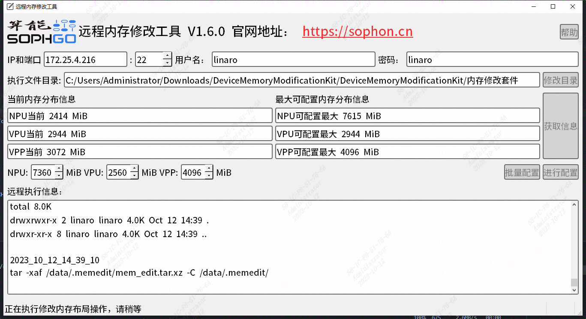

# ChatGLM2

## 目录
- [ChatGLM2](#chatglm2)
  - [目录](#目录)
  - [1. 简介](#1-简介)
  - [2. 运行环境准备](#2-运行环境准备)
    - [2.1 方式一](#21-方式一)
    - [2.1 方式二](#21-方式二)
  - [3. 准备模型](#3-准备模型)
  - [4. 例程测试](#4-例程测试)

## 1. 简介
ChatGLM2-6B 是开源中英双语对话模型 ChatGLM-6B 的第二代版本,相比于初代模型，具有更强大的性能，更长的上下文，更高的推理性能和更开放的协议，ChatGLM2-6B 权重对学术研究完全开放。

该例程支持在V23.03.01(libsophon_0.4.6)及以上的SDK上运行，提供了三个版本,分别是C++、python、python_web版本，三个版本可以独立运行，支持在插有1684X系列加速卡的x86主机上运行，也可以SE7上运行。其中在SE7上运行需要额外进行环境配置，请参照[运行环境准备](#2-运行环境准备)完成环境部署。

## 2. 运行环境准备
以下为soc模式相关：
### 2.1 方式一
这是最推荐的方式，对于1684X系列设备（如SE7），都可以通过这种方式完成环境准备，使得满足chatGLM2运行条件。首先，下载根据[修改工具](https://doc.sophgo.com/sdk-docs/v23.07.01/docs_latest_release/docs/SophonSDK_doc/zh/html/appendix/2_mem_edit_tools.html)将设备的内存修改为：

NPU:7360 MiB

VPU:2560 MiB 

VPP:4096 MiB



**注意：**应该保留一定的系统内存用于设备编译。

### 2.1 方式二
这里特别提供SE7刷机包，刷机包已经完成环境部署，并且内置chatglm2_soc版本的程序，刷机包地址如下：
```
pip3 install dfss -i https://pypi.tuna.tsinghua.edu.cn/simple --upgrade
python3 -m dfss --url=open@sophgo.com:sophon-demo/chatglm/sdcard_chatglm2.zip
```
刷机方式可以参考[刷机问题](https://doc.sophgo.com/docs/3.0.0/docs_latest_release/faq/html/devices/SOC/soc_firmware_update.html?highlight=%E5%88%B7%E6%9C%BA),在完成刷机后，代码程序在`/data`目录下。当然，还是建议您使用sophon-demo下的程序,它是最新版本的。

## 3. 准备模型
该模型目前只支持在1684X上运行，已提供编译好的bmodel。
### 3.1 使用提供的模型

​本例程在`scripts`目录下提供了相关模型载脚本`download.sh`

```bash
# 安装unzip，若已安装请跳过，非ubuntu系统视情况使用yum或其他方式安装
sudo apt install unzip
chmod -R +x scripts/
./scripts/download.sh
```

执行程序后，当前目录下的文件如下：

```
.
├── cpp                                  #cpp版本
│   ├── chatglm2.hpp                     #chatglm2推理base 
│   ├── CMakeLists.txt
│   ├── lib_pcie                         #pcie依赖的libsentencepiece.a
│   ├── lib_soc                          #soc依赖的libsentencepiece.a
│   ├── main.cpp                         #主程序
│   ├── sentencepiece                    #sentencepiece头文件
│   └── README.md                        #使用说明
├── models
│   └── BM1684X                          #bmodel、token
│       ├─ chatglm2-6b_f16.bmodel
│       ├─ chatglm2-6b_int8.bmodel
│       └─ chatglm2-6b_int4.bmodel
├── python
│   ├── chatglm2.py                      #主程序
│   ├── CMakeLists.txt
│   └── pybind.cpp                       #绑定chatglm2推理base 
│   └── README.md                        #使用说明
├── python_web
│   ├── CMakeLists.txt
│   ├── pybind.cpp                       #绑定chatglm2推理base 
│   ├── web_chatglm2.py                  #主程序
│   └── README.md                        #使用说明
├── README.md                            #使用说明
└── script
    ├── download.sh                      #模型下载脚本
    └── compile                          #编译模型相关的脚本
        ├── compile.sh                   #编译bmodel脚本
        └── export_onnx.py               #导出onnx所需脚本
```

**注意：**在下载模型前，应该保证存储空间大于25GB。

### 3.2 自行编译模型
编译模型需要在x86主机完成。

**注意：** ChatGLM2-6B官方库25G左右，转模型需要保证运行内存至少32G以上，导出onnx模型需要存储空间50G以上，fp16模型转换需要存储空间180G以上，int8和int4模型需要的空间会更少。

模型编译的详细信息可以参考[sophgo/ChatGLM2-TPU](https://github.com/sophgo/ChatGLM2-TPU)。
以下是基本步骤：

1. 将mlir移动到chatglm2目录下

2. 下载docker，启动容器

```bash
docker pull sophgo/tpuc_dev:latest

# myname1234 is just an example, you can set your own name
docker run --privileged --name myname1234 -v $PWD:/workspace -it sophgo/tpuc_dev:latest
```
当前$PWD应该是sophon-demo/sample/chatglm2

后文假定环境都在docker的/workspace目录。


3. 下载ChatGLM2-6B

```bash
git lfs install
git clone git@hf.co:THUDM/chatglm2-6b
```

如果无法官网下载，也可以下载我们之前下好的，压缩包20G左右
```bash
pip3 install dfss
python3 -m dfss --url=open@sophgo.com:LLM/chatglm2-6b.tgz
tar zxvf chatglm2-6b.tgz
```

并对该工程做三点修改：

- 将config.json文件中seq_length配置为512；

- 将modeling_chatglm.py文件中的如下代码：

```bash
if attention_mask is not None:
    attention_scores = attention_scores.masked_fill(attention_mask, float("-inf"))
```
修改为：

```bash
if attention_mask is not None:
    attention_scores = attention_scores + (attention_mask * -10000.0)
```
这样修改可以提升效率，使用masked_fill效率低下；另一方面masked_fill转ONNX存在些bug。

- 将modeling_chatglm.py文件中的如下代码：

```bash
pytorch_major_version = int(torch.__version__.split('.')[0])
if pytorch_major_version >= 2:
```
修改为

```bash
pytorch_major_version = int(torch.__version__.split('.')[0])
if False:
```
4. 指定ChatGLM2-6B的python路径

```bash
export PYTHONPATH=/workspace/chatglm2-6b:$PYTHONPATH
```
5. 导出所有onnx模型，如果过程中提示缺少某些组件，直接pip install 组件即可

```bash
cd script/compile
python3 export_onnx.py
```
此时有大量onnx模型被导出到compile/tmp目录。

6. 对onnx模型进行编译

目前TPU-MLIR支持对ChatGLM2进行F16, INT8和INT4量化，默认情况下会进行F16量化

初始化mlir环境

```bash
cd /workspace
source tpu-mlir/envsetup.sh
```
编译模型，生成chatglm2-6b_f16.bmodel
```bash
./compile.sh
```
若想进行INT8或INT4量化，则执行以下命令，最终生成chatglm2-6b_int8.bmodel或chatglm2-6b_int4.bmodel文件

```bash
./compile.sh --mode int8 # or int4
```

## 4. 例程测试

本例程一共分为三个版本，分别是cpp、python以及web版本，具体的编译和运行方法如下。为了提高运行效率，python和web版本都是通过调用cpp接口实现的。因此，每个版本都需要编译。

注：docker环境只与转模型有关，与运行环境无关。

- [C++例程](./cpp/README.md)
- [Python例程](./python/README.md)
- [Python_web例程](./python_web/README.md)

